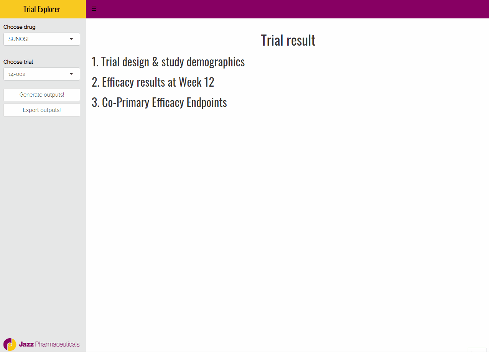

<!-- README.md is generated from README.Rmd. Please edit that file -->

```{r, include = FALSE}
knitr::opts_chunk$set(
  collapse = TRUE,
  comment = "#>",
  fig.path = "man/figures/README-",
  out.width = "100%"
)
```

# jazzR

<!-- badges: start -->
[](https://lifecycle.r-lib.org/articles/stages.html#experimental)
<!-- badges: end -->

The goal of jazzR is to provide scientists and statisticians at Jazz Pharma with a tool to easily analyze clinical trials data, and generate various outputs needed to document clinical trials. jazzR can help you make:

- Trial design & study demographics summary
- Efficacy results table 
- Co-primary efficacy endpoints visualization

## Progress



## Installation

You can install the development version of jazzR like so:

```{r eval=FALSE}
remotes::install_github("jiwanheo/jazzR")
```


